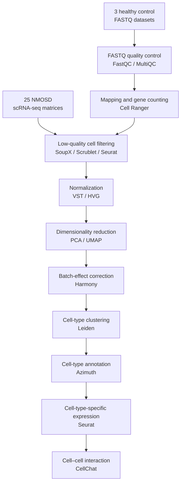

# Description

This repository contains the source code for the single-cell RNA sequencing (scRNA-seq) analysis of neuromyelitis optica spectrum disorder (NMOSD) and healthy control samples. The workflow includes quality control, normalization, dimensionality reduction, batch-effect correction, cell-type clustering, cell-type annotation, cell-type-specific expression analysis, and cell–cell interaction analysis.

## Software Versions

### R

| Package | Version |
|---|---|
| SeuratObject | 5.2.0 |
| Seurat | 5.3.0 |
| SoupX | 1.6.2 |

### Python

| Environment | Version |
|---|---|
| `scrublet_env` | 3.10.8 |
| `scrublet` | 3.10.18 |
| `jupyter_env` | 3.9.20 |
| `base` | 3.13.5 |

## Analysis Workflow

## Analysis Pipeline and Source Code

| Step | Description | Source code |
|---|---|---|
| Input data | 25 NMOSD scRNA-seq matrices and 3 healthy control FASTQ datasets. | `PYTHON/nmosd_read_mtx.ipynb`, `PYTHON/cellranger_10x_to_h5ad.ipynb`, `R/My_nmosd_mtx.R` |
| FASTQ processing | FASTQ quality assessment, read mapping, and gene counting. | FastQC and MultiQC were used for FASTQ quality assessment, while Cell Ranger was used for read mapping and gene counting. These preprocessing tools are not included in this repository. |
| Low-quality cell filtering | Removal of low-quality cells, ambient RNA, and potential doublets. | `R/Soupx.R`, `PYTHON/nmosd_scrublet.ipynb`, `R/nmosd_scrna_preprocessing.R`, `R/my_control_scrna_preprocessing.R` |
| Normalization | VST normalization and highly variable gene selection. | `R/CPM_VST.R`, `R/VST.R`, `R/My_nmosd_PCA.R`, `R/merge_normalized.R` |
| Dimensionality reduction | PCA and UMAP calculation for downstream analysis and visualization. | `R/My_nmosd_PCA.R`, `PYTHON/My_nmosd_pca_umap.ipynb` |
| Batch-effect correction | Correction of sample-related batch effects using Harmony. | `R/My_nmosd_harmony.R` |
| Cell-type clustering | Neighborhood construction and Leiden clustering. | `PYTHON/Leiden_analyze.py`, `PYTHON/My_nmosd_scRNA_leiden.ipynb`, `PYTHON/My_nmosd_scRNA_leiden_PC50(Harmony).ipynb` |
| Cell-type annotation | Cell identity assignment using Azimuth. | `R/seurat_azimuth_map.R`, `PYTHON/My_nmosd_Harmony_Azimuth_PC50.ipynb`, `PYTHON/Azimuth_celltype.py`, `PYTHON/umap_Azimuth_celltype.py` |
| Cell-type-specific expression | Marker gene and differential expression analysis using Seurat. | `R/my_merge_findmarker.R` |
| Cell–cell interaction | Ligand–receptor interaction analysis using CellChat. | `R/My_cellchat.R`, `R/My_BAFF_BAFFR_spearman.R` |
